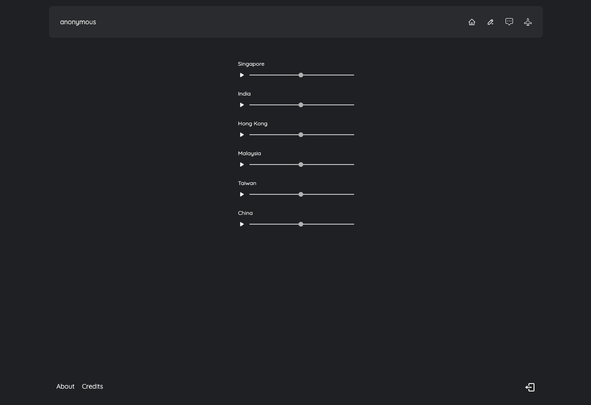
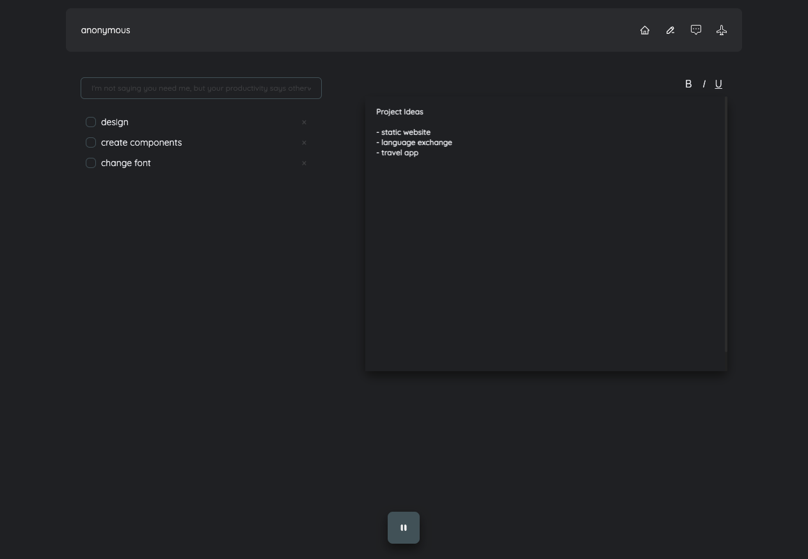
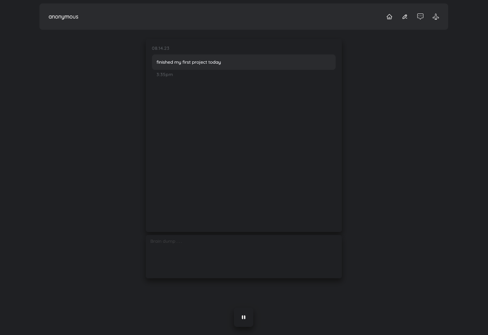
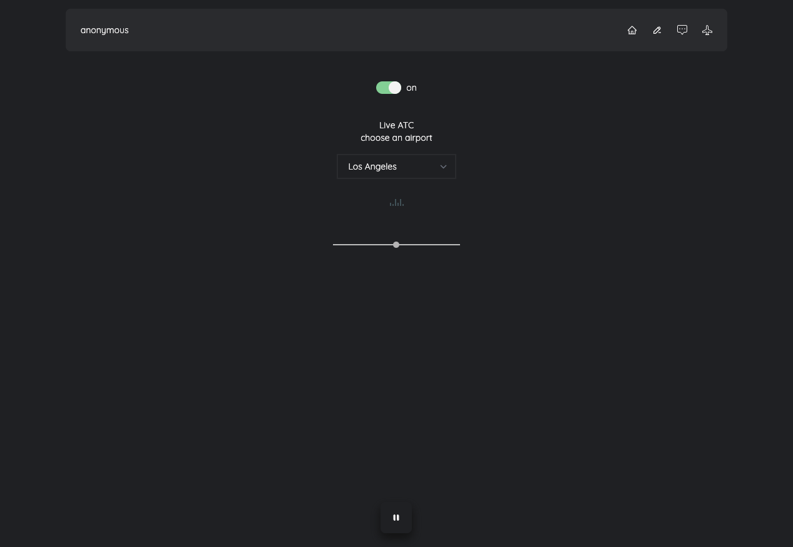

# Cyber Bubble

Cyber Bubble is a web app designed as a space for people to be in their ‘bubble’ while documenting thoughts and ideas. It was inspired by the pandemic and the longing for travel as many people miss the familiar sounds of home. Hence the app has audios that are meant to provide a sense of familiarity to those who are working, studying or just going about their daily lives.

**[View Site](https://cyberbubblev2.vercel.app)**

## Built With

- React
- Firebase
- TailwindCSS

## Features

- Create an account with Google or sign in anonymously.
- **Homepage**- play sounds of different cities while navigating between pages
- **Productive page** - create to-do list and document on text-editor.
- **Log page** - a chat box that keeps a log of all the messages with timestamp and date.
- **Airplane page** - play live air traffic control from different airports.

## At a Glance

|              Homepage              |             Productive              |
| :--------------------------------: | :---------------------------------: |
|  |  |

|                Log                |        Air Traffic Control        |
| :-------------------------------: | :-------------------------------: |
|  |  |

## Getting Started

1. Clone this repository and run:

```bash
npm install
```

2. Run the app

```bash
npm run dev
```
